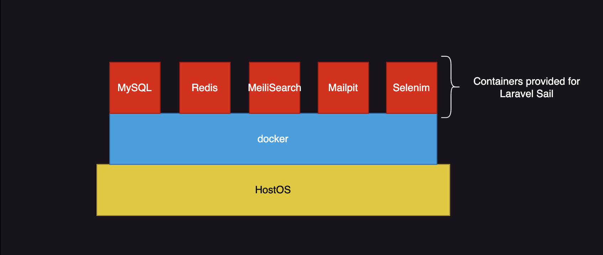

# Laravel Sail

## About Laravel Sail

Laravel Sail is the official development environment for the Laravel framework. Sail provides a lightweight command-line interface (CLI) to easily set up and manage a Laravel application development environment using Docker. Below, we explain the main features and usage of Laravel Sail.

## Benefits of Using Laravel Sail

1. **Build a development environment independent of the OS**
    - Sail uses Docker to containerize the development environment for Laravel applications. This allows you to build a development environment that is independent of the OS.
2. **Easy setup of the development environment**
    - With Sail, you can set up a Laravel development environment with just a few commands. Even complex development environments using MySQL, Redis, MailHog, etc., can be easily built.
3. **Easy management of projects with different versions**
    - For example, the version of Laravel depends on the version of PHP, but by setting the environment for each project in the docker-compose.yml file, you can easily switch versions.


When you create a project using Docker with Laravel Sail, the structure will look like the diagram below.

## Usage

### 1. Creating a Laravel Project

Run the following command to create a new Laravel project and set up Laravel Sail.

```bash
curl -s "https://laravel.build/example-app" | bash
cd example-app
```

This will create the Laravel project files. The development environment is described in the generated docker-compose.yml file.

#### Specify services with the `with` query

If you want to specify the PHP version or use PostgreSQL instead of MySQL, you can specify `with=<service>,<service>,...` in the command when generating the project.

```bash
curl -s "https://laravel.build/example-app?php=81&with=pgsql,redis" | bash
```

### 2. Starting Sail

Move to the project directory and start Sail.

```bash
./vendor/bin/sail up -d
```

This command starts the Docker containers and runs the Laravel application.

#### ※Registering an alias

Typing `./vendor/bin/sail` an be cumbersome, so save it as an alias `sail` in your shell's configuration file.

Check the path of the shell you are using with the following command

```bash
echo $SHELL
```

Example: `/bin/zsh`

**Editing the Shell configuration file**

-   For zsh

The Shell configuration file is ~/.zshrc.
To add an alias, run the following command

```bash
echo "alias sail='sh $([ -f sail ] && echo sail || echo vendor/bin/sail)'" >> ~/.zshrc
source ~/.zshrc
```

-   For bash

The shell configuration file is ~/.bash_profile or ~/.bashrc.
To add an alias, run the following command:

```bash
echo "alias sail='sh $([ -f sail ] && echo sail || echo vendor/bin/sail)'" >> ~/.bash_profile
source ~/.bash_profile
```

With the above settings, you can run the sail command in a shortened form.

```bash
sail up -d
```

### 3. Using Sail Commands

You can use Sail to perform various development tasks. Here are some examples.

-   **Starting the application**:

```bash
sail up -d
```

-   **Stopping the application**:

```bash
sail down
```

-   **Running Artisan commands**:

```bash
sail artisan migrate
```

-   **Running Composer commands**:

```bash
sail composer install
```

-   **Running npm commands**:

```bash
sail npm install
```

### 4. Changing Services

Even after creating the project, you can change the services by modifying the docker-compose.yml file, which is the Docker configuration file. Here, we will change the PHP version and the database used.

#### Changing the PHP version

First, check the current PHP version

```bash
sail php -v
PHP 8.3.12 (cli) (built: Sep 27 2024 03:53:05) (NTS)
```

Next, modify the development environment information described in the docker-compose.yml file.

```php
services:
    laravel.test:
        build:
            context: "./vendor/laravel/sail/runtimes/8.3"
            dockerfile: Dockerfile
            args:
                WWWGROUP: "${WWWGROUP}"
        image: "sail-8.3/app"
```

Change `build context` and `image` to `8.1` .

```php
services:
    laravel.test:
        build:
            context: "./vendor/laravel/sail/runtimes/8.1"
            dockerfile: Dockerfile
            args:
                WWWGROUP: "${WWWGROUP}"
        image: "sail-8.1/app"
```

After modifying docker-compose.yml, stop the application.

```bash
sail down
```

Next, rebuild the Docker containers to reflect the changes.

```bash
sail build --no-cache
```

Restart the application.

```bash
sail up -d
```

Check if the PHP version has changed.

```bash
sail php -v
PHP 8.1.30 (cli) (built: Sep 27 2024 04:07:29) (NTS)
```

The PHP version has been changed from PHP 8.3 to PHP 8.1.

#### Changing the database used

Change a project created with MySQL to PostgreSQL.

Run the Sail installation command

```bash
sail php artisan sail:install
```

Select `pgsql`

```bash
 ┌ Which services would you like to install? ───────────────────┐
 │   ◼ mysql                                                  ┃ │
 │ › ◻ pgsql                                                  │ │
 │   ◻ mariadb                                                │ │
 │   ◻ redis                                                  │ │
 │   ◻ memcached                                              │ │
 └────────────────────────────────────────────────── 1 selected ┘
  Use the space bar to select options.
```

Check the docker-compose.yml file and confirm that the pgsql entries have been added.

```php
services:
    laravel.test:
...
        depends_on:
            - mysql
            - redis
            - meilisearch
            - mailpit
            - selenium
            - pgsql
...
        pgsql:
            image: 'postgres:17'
            ports:
                - '${FORWARD_DB_PORT:-5432}:5432'
            environment:
                PGPASSWORD: '${DB_PASSWORD:-secret}'
                POSTGRES_DB: '${DB_DATABASE}'
                POSTGRES_USER: '${DB_USERNAME}'
                POSTGRES_PASSWORD: '${DB_PASSWORD:-secret}'
            volumes:
                - 'sail-pgsql:/var/lib/postgresql/data'
                - './vendor/laravel/sail/database/pgsql/create-testing-database.sql:/docker-entrypoint-initdb.d/10-create-testing-database.sql'
            networks:
                - sail
            healthcheck:
                test:
                    - CMD
                    - pg_isready
                    - '-q'
                    - '-d'
                    - '${DB_DATABASE}'
                    - '-U'
                    - '${DB_USERNAME}'
                retries: 3
                timeout: 5s
```

ext, open the .env file in the project directory and confirm that `DB_CONNECTION=pgsql` and `DB_HOST=pgsql` are set.
If not, change them manually.

```.env
DB_CONNECTION=pgsql
DB_HOST=pgsql
DB_PORT=5432
DB_DATABASE=laravel
DB_USERNAME=sail
DB_PASSWORD=******
```

After confirming the changes in docker-compose.yml and .env, stop the application.

```bash
sail down
```

Next, rebuild the Docker containers to reflect the changes.

```bash
sail build --no-cache
```

Restart the application.

```bash
sail up -d
```

Run the migration files.

```bash
sail artisan migrate

INFO  Preparing database.

Creating migration table ................................ 6.00ms DONE

INFO  Running migrations.

0001_01_01_000000_create_users_table .................... 5.74ms DONE
0001_01_01_000001_create_cache_table .................... 1.45ms DONE
0001_01_01_000002_create_jobs_table ..................... 3.44ms DONE
```

**Start a shell in Docker and check pgsql**

Display the list of currently running Docker containers.

```bash
sail ps
```

```bash
NAME                                IMAGE                          COMMAND                  SERVICE
laravel-sail-setup-laravel.test-1   sail-8.3/app                   "start-container"        laravel.test
laravel-sail-setup-mailpit-1        axllent/mailpit:latest         "/mailpit"               mailpit

```

Check the container name of the application and start the bash of the application inside Docker.

```bash
docker exec -it laravel-sail-setup-laravel.test-1 bash
```

Connect to pgsql.

```bash
psql -U sail -h pgsql laravel
```

You will be prompted for a password, so enter the DB_PASSWORD specified in the .env file.

```bash
Password for user sail:******
```

Check the tables in pgsql

```bash
laravel=# \dt
               List of relations
 Schema |         Name          | Type  | Owner
--------+-----------------------+-------+-------
 public | cache                 | table | sail
 public | cache_locks           | table | sail
 public | failed_jobs           | table | sail
 public | job_batches           | table | sail
 public | jobs                  | table | sail
 public | migrations            | table | sail
 public | password_reset_tokens | table | sail
 public | sessions              | table | sail
 public | users                 | table | sail
(9 rows)
```

In this way, you can change from MySQL to PostgreSQL even after creating the project.
